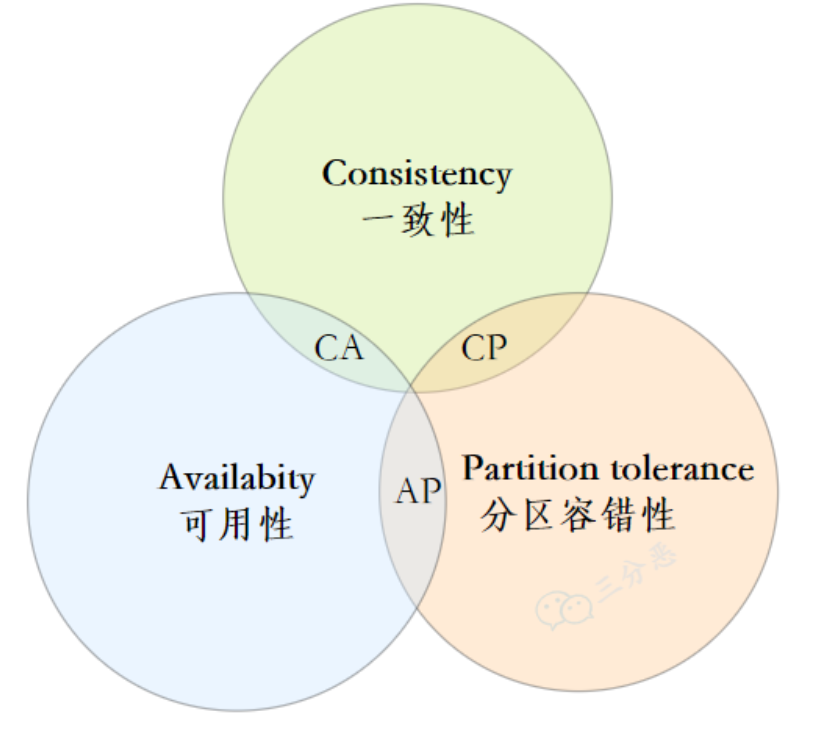
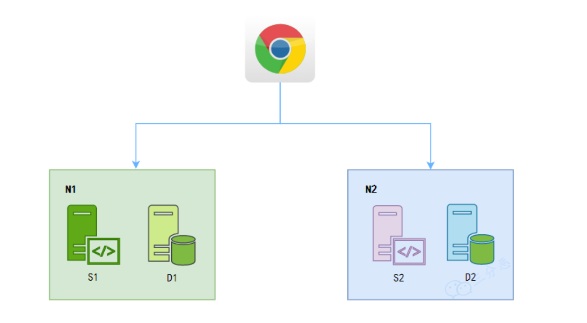

## CAP理论

* C: consistency，一致性

  > 保证每个分区的数据一致

* A：available ，可用性

  > 系统的服务一致处于可用的状态，会返回正确的请求

* P：partition tolerance 分区容错性

  > 网络端开，分区也能独立地提供服务

* 为什么CA不能共存

  

   * 假设现在客户端访问了N1，在D1中写入了数据，然后去读D2
     * 保证一致性：N2不可用
     * 保证可用性：数据不一致

## BASE理论

* B：Basic Available 基本可用
* S：Soft-state 软状态
* E：Eventually Consistent 最终一致
* 是在CAP理论上地权衡

